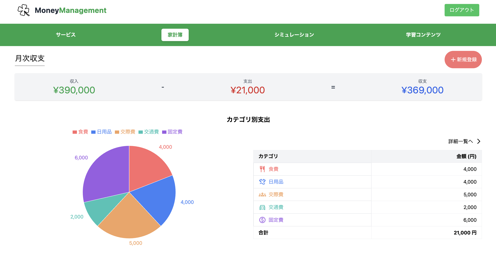
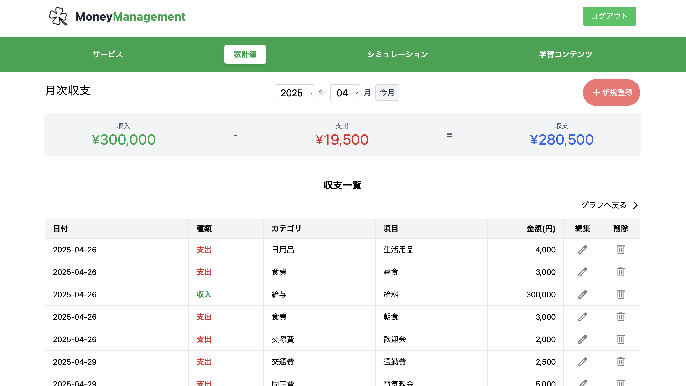
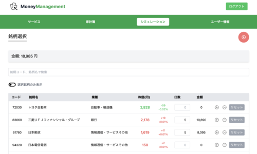
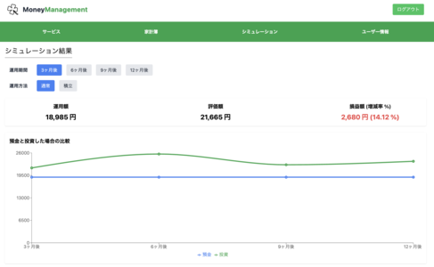
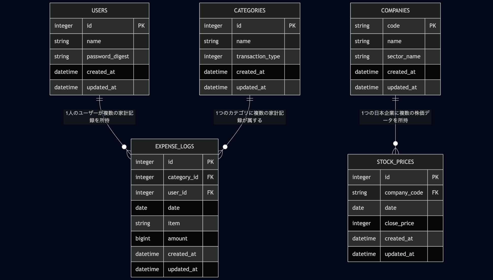
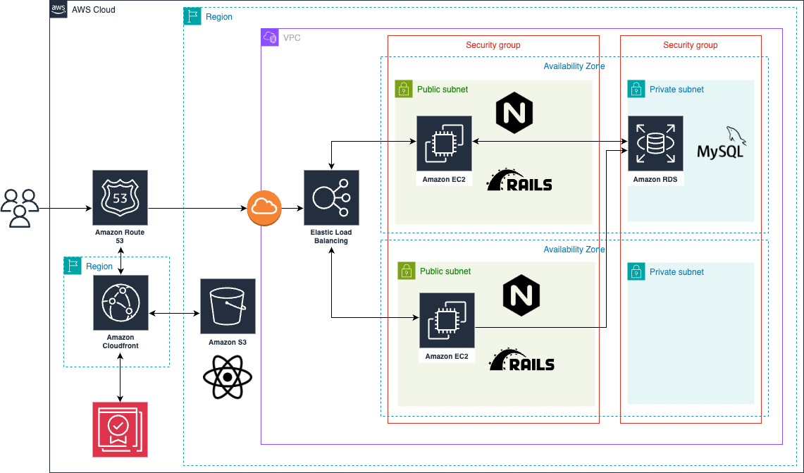

## 概要
誰でも使える家計簿とリアルな投資シミュレーションで、資産運用の第一歩をサポートするサービスです。

## オリジナルプロダクトの URL
https://moneymanagement.jp/

## サービスへの想い
このプロダクトは、投資による資産形成を始めたいが、「難しそう」「損をしそう」といったイメージを抱いている人の不安を払拭したい、という想いから生まれました。

ただ情報を読んだり聞いたりするだけではなく、実際の株価を用いた仮想的な投資体験を通じて、行動につながる学びを促します。さらに家計簿機能により、自分の支出状況に応じた実践的なシミュレーションが可能です。

「貯蓄から投資」への転換により、経済成長と資産所得の拡大という好循環を生み出し、より豊かな社会の実現に貢献します。

## 画面キャプチャ

<table style="width: 100%;">
  <tr>
    <th style="width: 50%; text-align: center;">新規登録画面</th>
    <th style="width: 50%; text-align: center;">ホーム画面（ログイン時）</th>
  </tr>
  <tr>
    <td align="center">
      
    </td>
    <td align="center">
      
    </td>
  </tr>
  <tr>
    <td align="center">ユーザー名とパスワードでログイン可能です。</td>
    <td align="center">ログイン後にナビゲーションバーから各機能を選択します。</td>
  </tr>
</table>

<table style="width: 100%;">
  <tr>
    <th style="width: 50%; text-align: center;">家計簿トップ画面</th>
    <th style="width: 50%; text-align: center;">家計簿詳細画面</th>
  </tr>
  <tr>
    <td align="center">
      
    </td>
    <td align="center">
      
    </td>
  </tr>
  <tr>
    <td align="center">
      カテゴリ別の支出を円グラフで表示し、 
      家計の状況を一目で把握できるようにしました。
    </td>
    <td align="center">
      記録の編集・削除に対応した 
      詳細画面を用意しました。
    </td>
  </tr>
</table>

<table style="width: 100%;">
  <tr>
    <th style="width: 50%; text-align: center;">銘柄選択画面</th>
    <th style="width: 50%; text-align: center;">シミュレーション結果画面</th>
  </tr>
  <tr>
    <td align="center">
      
    </td>
    <td align="center">
      
    </td>
  </tr>
  <tr>
    <td align="center">
      実際の銘柄から選択し、 
      投資のシミュレーションが行えます。
    </td>
    <td align="center">
      運用期間に応じた 
      損益シミュレーション結果を表示します。
    </td>
  </tr>
</table>

## 使用技術
| Category          | Technology Stack                                     |
| ----------------- | --------------------------------------------------   |
| Frontend          | React                                                |
| Backend           | Ruby on Rails                                        |
| Infrastructure    | Amazon Web Services                                  |
| Database          | MySQL                                                |
| CI/CD             | GitHub Actions                                       |
| etc.              | TailwindCSS, draw.io, Git, GitHub                    |

## ER 図

## インフラ構成図

## 機能一覧
- 会員登録、ログイン／ログアウト
- 支出・収入の記録（カテゴリ・金額・日付・メモ）
- 月ごとの収支サマリー表示
- カテゴリ別の支出グラフ表示
- 仮想投資プランの作成（銘柄・数量・期間指定）
- 過去の株価データに基づいた運用結果の表示
- AIによる運用結果の分析・アドバイス