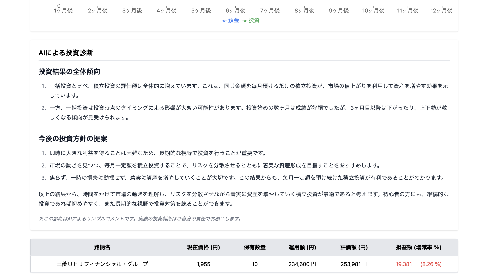

## 概要
誰でも使える家計簿とAI診断を用いた投資シミュレーションで、資産運用の第一歩をサポートするサービスです。

## オリジナルプロダクトの URL
https://moneymanagement.jp/

## サービスへの想い
このプロダクトは、投資による資産形成を始めたいが、「難しそう」「損をしそう」といったイメージを抱いている人の不安を払拭したい、という想いから生まれました。

ただ情報を読んだり聞いたりするだけではなく、実際の株価を用いた仮想的な投資体験とAIによる診断結果を掲示することで、行動につながる学びを提供します。さらに家計簿機能により、自分の支出状況に応じた実践的なシミュレーションが可能です。

「貯蓄から投資」への転換により、経済成長と資産所得の拡大という好循環を生み出し、より豊かな社会の実現に貢献します。

## 画面キャプチャ

<table style="width: 100%;">
  <tr>
    <th style="width: 50%; text-align: center;">新規登録画面</th>
    <th style="width: 50%; text-align: center;">ホーム画面（ログイン時）</th>
  </tr>
  <tr>
    <td align="center">
      
    </td>
    <td align="center">
      
    </td>
  </tr>
  <tr>
    <td align="center">ユーザー名とパスワードでログイン可能です。</td>
    <td align="center">ログイン後にナビゲーションバーから各機能を選択します。</td>
  </tr>
</table>

<table style="width: 100%;">
  <tr>
    <th style="width: 50%; text-align: center;">家計簿トップ画面</th>
    <th style="width: 50%; text-align: center;">家計簿詳細画面</th>
  </tr>
  <tr>
    <td align="center">
      
    </td>
    <td align="center">
      
    </td>
  </tr>
  <tr>
    <td align="center">
      カテゴリ別の支出を円グラフで表示し、 
      家計の状況を一目で把握できるようにしました。
    </td>
    <td align="center">
      記録の編集・削除に対応した 
      詳細画面を用意しました。
    </td>
  </tr>
</table>

<table style="width: 100%;">
  <tr>
    <th style="width: 50%; text-align: center;">銘柄選択画面</th>
    <th style="width: 50%; text-align: center;">シミュレーション結果画面1（グラフ表示）</th>
  </tr>
  <tr>
    <td align="center">
      
    </td>
    <td align="center">
      
    </td>
  </tr>
  <tr>
    <td align="center">
      実際の銘柄から選択し、 
      投資のシミュレーションが行えます。
    </td>
    <td align="center">
      運用期間に応じた 
      損益シミュレーション結果をグラフで表示します。
    </td>
  </tr>
</table>

<table style="width: 100%;">
  <tr>
    <th style="width: 50%; text-align: center;">シミュレーション結果画面2（AI診断結果）</th>
    <th style="width: 50%; text-align: center;">学習コンテンツ画面</th>
  </tr>
  <tr>
    <td align="center">
      
    </td>
    <td align="center">
      
    </td>
  </tr>
  <tr>
    <td align="center">
      損益シミュレーション結果に対して、 
      AIが運用方法の分析やアドバイスをします。
    </td>
    <td align="center">
      投資未経験者を対象にした 
      資産運用に関するノウハウの説明動画を紹介します。
    </td>
  </tr>
</table>

## 使用技術
| Category       | Technology Stack                                                                             |
|----------------|----------------------------------------------------------------------------------------------|
| Frontend       | React (v18), Vite                                                                            |
| Backend        | Ruby on Rails (v8.0)                                                                         |
| Infrastructure | Amazon Web Services (S3, CloudFront, EC2, RDS, Route 53, ELB, CloudWatch)                    |
| Database       | MySQL (v8.0)                                                                                 |
| CI/CD          | GitHub Actions                                                                               |
| etc.           | Nginx, Tailwind CSS, draw.io, Git, GitHub                                                    |

## ER 図

## インフラ構成図

## 機能一覧
- 会員登録、ログイン／ログアウト
- 支出・収入の記録（カテゴリ・金額・日付・メモ）
- 月ごとの収支サマリー表示
- カテゴリ別の支出グラフ表示
- 仮想投資プランの作成（銘柄・数量・期間指定）
- 過去の株価データに基づいた運用結果の表示
- AIによる運用結果の分析・アドバイス

## 技術的な工夫
- OpenAI APIとJ-Quants APIを連携し、実際の株価データを用いた投資結果に対するAIアドバイスを自動生成。
- Rails APIとReactのフロントエンドを完全分離し、S3＋CloudFrontで高速なSPA表示を実現し、ページ遷移の高速化と低コスト運用を実現。
- ユーザー認証には JSON Web Tokenを用い、サーバー側にセッション情報を保持しないステートレスな認証方式を採用。

## ユーザー目線での工夫
- グラフやAIによるを用いることで、「なぜこの結果になったのか」「どうすればよかったのか」を直感的に理解できるように実装。
- 家計簿と投資シミュレーションの連携により単なる仮想投資ではなく、ユーザー自身の支出状況をもとに「自分ならこのくらい投資できそう」と具体的に考えるきっかけを提供。
- 投資未経験者でも直感的に操作できるUI設計。
- ナビゲーションバーを設定し、数クリックで各機能にたどり着けるように設計し、迷わず体験できるフローを意識。