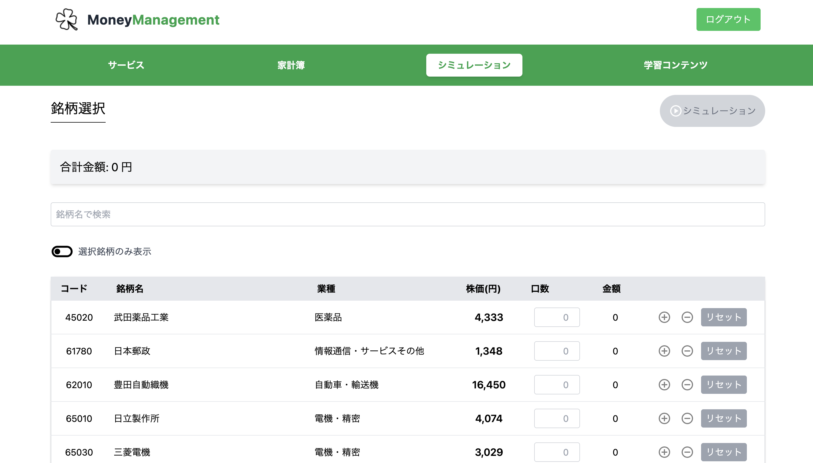

## 概要
誰でも使える家計簿とリアルな投資シミュレーションで、資産運用の第一歩をサポートするサービスです。

## オリジナルプロダクトの URL
https://moneymanagement.jp/

## サービスへの想い
このプロダクトは、投資をして資産形成を始めたいが、「難しそう」「損をしそう」といったイメージを抱いている人の不安を払拭したい、という想いから生まれました。

ただ読んだり聞いたりするだけではなく、仮想的な投資体験を通じて「自分でもできそう」という実感と、投資への理解を深めるきっかけを提供します。また、家計簿の機能もあるため、自分の支出状況に応じたシミュレーションが可能となり、より実践的な体験を通じた学びを提供します。

「貯蓄から投資」への転換により、経済成長と資産所得の拡大という好循環を生み出すことで、より豊かな社会の実現に貢献します。

## 画面キャプチャ

<table style="width: 100%;">
  <tr>
    <th style="width: 50%; text-align: center;">新規登録画面</th>
    <th style="width: 50%; text-align: center;">ホーム画面（ログイン時）</th>
  </tr>
  <tr>
    <td align="center">
      
    </td>
    <td align="center">
      
    </td>
  </tr>
  <tr>
    <td align="center">ユーザー名とパスワードによる認証機能を実装しました。</td>
    <td align="center">ログイン時にナビゲーションバーから各機能を選択します。</td>
  </tr>
</table>

<table style="width: 100%;">
  <tr>
    <th style="width: 50%; text-align: center;">家計簿トップ画面</th>
    <th style="width: 50%; text-align: center;">家計簿詳細画面</th>
  </tr>
  <tr>
    <td align="center">
      
    </td>
    <td align="center">
      
    </td>
  </tr>
  <tr>
    <td align="center">
      カテゴリ別の支出を円グラフで表示し、 
      家計の状況を一目で把握できるようにしました。
    </td>
    <td align="center">
      記録の編集・削除が可能な 
      家計簿詳細画面を実装しました。
    </td>
  </tr>
</table>

<table style="width: 100%;">
  <tr>
    <th style="width: 50%; text-align: center;">銘柄選択画面</th>
    <th style="width: 50%; text-align: center;">シミュレーション結果画面</th>
  </tr>
  <tr>
    <td align="center">
      
    </td>
    <td align="center">
      
    </td>
  </tr>
  <tr>
    <td align="center">
      実際の銘柄から選択し、 
      投資のシミュレーションが行えます。
    </td>
    <td align="center">
      運用期間に応じた 
      損益シミュレーション結果を表示します。
    </td>
  </tr>
</table>

## 使用技術

## ER 図

## インフラ構成図

## 機能一覧
