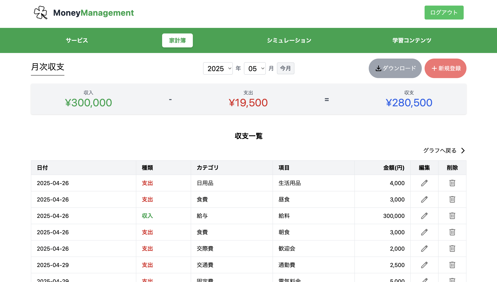

## 概要
誰でも使える家計簿とリアルな投資シミュレーションで、資産運用の第一歩をサポートするサービスです。

## オリジナルプロダクトの URL
https://moneymanagement.jp/

## サービスへの想い
日本では、家計資産の多くが現金や預金で保有されています。投資への関心は高まっていますが、「難しそう」「損をしそう」と不安を感じて、一歩を踏み出せない人も少なくありません。私自身も、何から始めればいいのか分からずに悩んだ経験があります。

そんな自分の体験から、同じように迷っている人の力になりたいと思い、このサービスをつくりました。家計の見直しから始めて、安心して投資にチャレンジできる環境を整えています。お金と向き合う第一歩を、そっと後押しできたら嬉しいです。

## 画面キャプチャ

<table style="width: 100%;">
  <tr>
    <th style="width: 50%; text-align: center;">トップ画面</th>
    <th style="width: 50%; text-align: center;">ログイン/新規登録画面</th>
  </tr>
  <tr>
    <td align="center">
      
    </td>
    <td align="center">
      
    </td>
  </tr>
  <tr>
    <td align="center">初めて訪れるユーザー向けに、サービス概要の説明機能を実装しました。</td>
    <td align="center">ユーザー名とパスワードによる認証機能を実装しました。</td>
  </tr>
</table>

 

<table>
  <tr>
    <th style="width: 50%; text-align: center;">家計簿トップ画面</th>
    <th style="width: 50%; text-align: center;">家計簿詳細画面</th>
  </tr>
  <tr>
    <td align="center">
      
    </td>
    <td align="center">
      
    </td>
  </tr>
  <tr>
    <td align="center">
      カテゴリ別の支出を円グラフで表示し、 
      家計の状況を一目で把握できるようにしました。
    </td>
    <td align="center">
      記録の編集・削除が可能な 
      家計簿詳細画面を実装しました。
    </td>
  </tr>
</table>

 

<table>
  <tr>
    <th style="width: 50%; text-align: center;">銘柄選択画面</th>
    <th style="width: 50%; text-align: center;">シミュレーション結果画面</th>
  </tr>
  <tr>
    <td align="center">
      
    </td>
    <td align="center">
      
    </td>
  </tr>
  <tr>
    <td align="center">
      実際の銘柄から選択し、 
      投資のシミュレーションが行えます。
    </td>
    <td align="center">
      運用期間に応じた 
      損益シミュレーション結果を表示します。
    </td>
  </tr>
</table>

## 使用技術

## ER 図

## インフラ構成図

## 機能一覧
