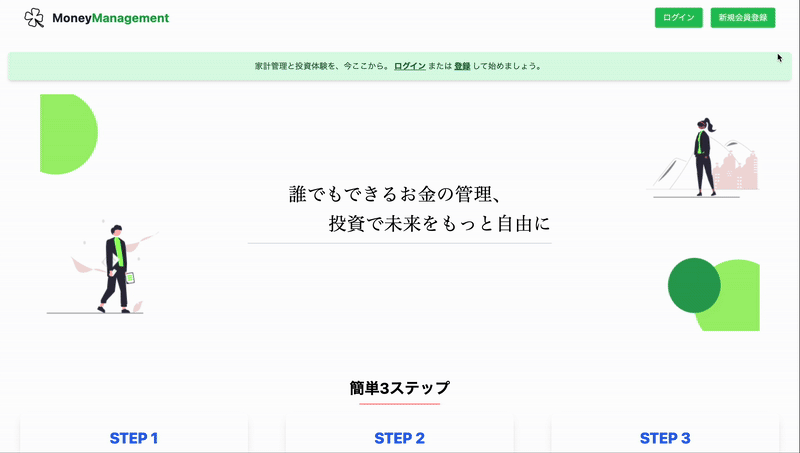
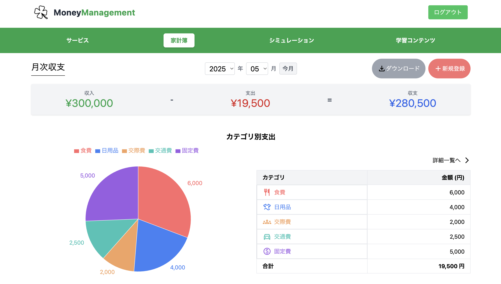
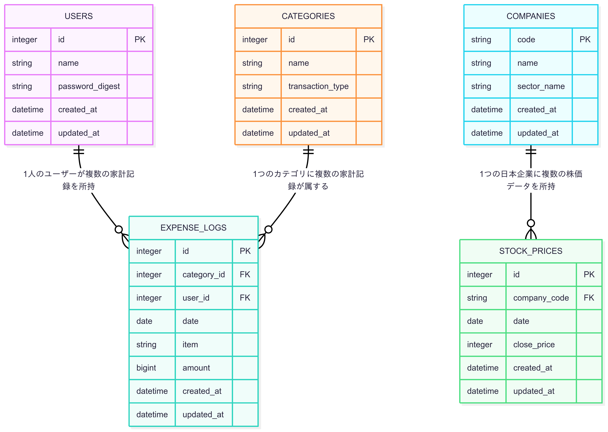

## 概要
「Money Management(マネーマネジメント)」は、投資初心者が安心して資産運用を始められるよう、AIでサポートするサービスです。

## オリジナルプロダクトの URL
https://moneymanagement.jp/

## サービスへの想い
本プロダクトは、投資による資産形成に興味を持ちながらも、「難しそう」「損をしそう」といった不安を抱えている人を支援したいという想いから開発しました。

単に情報を読んだり聞いたりするだけではなく、実際の株価を用いた仮想投資体験と、その結果に対するAI診断を掲示して、実践的な学びを提供します。
さらに、家計簿機能により支出状況を可視化し、投資に充てられる資金を把握することで、より現実的な資産形成のサポートが可能です。

本プロダクトが、社会的な「貯蓄から投資へ」を後押し、個人の資産形成と経済成長の好循環を促し、より豊かな社会を実現することを目指しております。

## 画面キャプチャ

<table style="width: 100%;">
  <tr>
    <th style="width: 50%; text-align: center;">新規登録</th>
    <th style="width: 50%; text-align: center;">ホーム（ログイン時）</th>
  </tr>
  <tr>
    <td align="center">
      
    </td>
    <td align="center">
      
    </td>
  </tr>
  <tr>
    <td align="center">ユーザー名とパスワードでログイン可能です。</td>
    <td align="center">ログイン後にナビゲーションバーから各機能を選択します。</td>
  </tr>
</table>

<table style="width: 100%;">
  <tr>
    <th style="width: 50%; text-align: center;">家計簿トップ</th>
    <th style="width: 50%; text-align: center;">家計簿詳細</th>
  </tr>
  <tr>
    <td align="center">
      
    </td>
    <td align="center">
      
    </td>
  </tr>
  <tr>
    <td align="center">
      カテゴリ別の支出を円グラフで表示し、 
      一目で支出状況の把握が可能です。
    </td>
    <td align="center">
      記録の詳細が確認できるとともに 
      編集・削除が可能です。
    </td>
  </tr>
</table>

<table style="width: 100%;">
  <tr>
    <th style="width: 50%; text-align: center;">銘柄選択</th>
    <th style="width: 50%; text-align: center;">シミュレーション結果1（グラフ表示）</th>
  </tr>
  <tr>
    <td align="center">
      
    </td>
    <td align="center">
      
    </td>
  </tr>
  <tr>
    <td align="center">
      実際の銘柄を選択し、 
      投資のシミュレーションが行えます。
    </td>
    <td align="center">
      運用期間と運用方法に応じた 
      損益シミュレーション結果をグラフで表示します。
    </td>
  </tr>
</table>

<table style="width: 100%;">
  <tr>
    <th style="width: 50%; text-align: center;">シミュレーション結果2（AI診断結果）</th>
    <th style="width: 50%; text-align: center;">学習コンテンツ</th>
  </tr>
  <tr>
    <td align="center">
      
    </td>
    <td align="center">
      
    </td>
  </tr>
  <tr>
    <td align="center">
      シミュレーション結果に対して、 
      AIが運用方法の分析やアドバイスをします。
    </td>
    <td align="center">
      投資未経験者を対象にした 
      資産運用に関する解説動画を紹介します。
    </td>
  </tr>
</table>

<table style="width: 100%;">
  <tr>
    <td align="center">
      シミュレーション結果(動画)
    </td>
  </tr>
  <tr>
    <td align="center">
      
    </td>
  </tr>
</table>

## 使用技術
| Category       | Technology Stack                                                                             |
|----------------|----------------------------------------------------------------------------------------------|
| Frontend       | React (v18)                                                                                  |
| Backend        | Ruby on Rails (v8.0)                                                                         |
| Infrastructure | Amazon Web Services (S3, CloudFront, EC2, RDS, Route 53, ELB, CloudWatch)                    |
| Database       | MySQL (v8.0)                                                                                 |
| CI/CD          | GitHub Actions                                                                               |
| etc.           | Nginx, Tailwind CSS, draw.io, Git, GitHub                                                    |

## ER 図

## インフラ構成図

## 機能一覧
- 会員登録、ログイン／ログアウト
- 支出・収入の記録（カテゴリ・内容・金額・日付）
- 月ごとの収支サマリー表示
- カテゴリ別の支出グラフ表示
- 仮想投資プランの作成（銘柄・数量・期間指定）
- 過去の株価データに基づいた運用結果の表示
- AIによる運用結果の分析・アドバイス

## 技術的な工夫
- 実際の株価データを用いた仮想投資体験とその結果に対するAI分析・アドバイスを提供するために、J-Quants API、OpenAI APIを活用。
- バックエンドとフロントエンドを完全に分離し、S3およびCloudFrontを活用したSPA実装。ページ遷移の高速化と低コストな運用を両立。
- モデル・リクエスト単位でRSpecテストを実装し、入力検証とビジネスロジックの期待動作を保証。

## ユーザー目線での工夫
- 初心者を対象としているため、グラフやAIを用いることで、「なぜこの結果になったのか」「どうすればよいのか」を理解できるように実装。
- 仮想投資体験のみではなく、家計簿機能を提供することで、自身の支出状況を可視化し「自分ならこのくらい投資できそう」「もっと節約すべき」という気づきや意識改革を支援し、習慣を変えるようサポート。
- ナビゲーションバーを設定し、数クリックで各機能にたどり着けるように設計し、迷わず操作できるフローを意識。