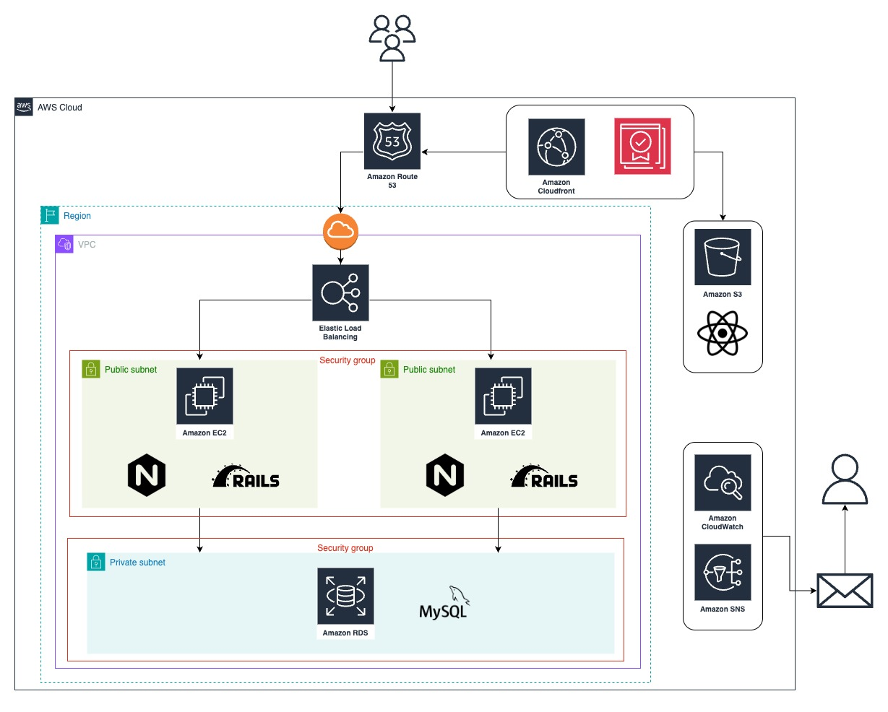

## ■　一言サービスコンセプト

## ■　サービスのURL
https://moneymanagement.jp/

## ■　誰のどんな課題を解決するのか
### 対象   
- 投資未経験者（特に両親）  
### 課題 
- 余裕資金の不足感：「投資に回せるお金がない」と感じ、行動に移せない。  
- 資産が減るリスクへの不安：「失敗して今の資産が減るのでは」というイメージの悪さ。  
- 知識不足による迷い：「どの投資商品を選べばよいのかわからない」という選択の難しさ。  

これらの課題を解決し、投資未経験者が一歩を踏み出すきっかけを提供、又はサポートすることを目指しています。

## ■　なぜそれを解決したいのか
### 投資が生む好循環
金融庁の調査によると、日本の家計金融資産約2000兆円のうち、半分以上が低リターンの現預金で保有されているようです。そのため、外国と比べて資産の増加スピードが低く、経済成長への貢献も限定的です。  
「貯蓄から投資」への転換により、家に眠る資金を企業の成長や社会課題解決に役立てるだけでなく、経済全体に好循環を生むことを期待しています。

### 自身の経験から
私自身も、投資を始める際には知識不足やリスクへの不安から行動に移せずに悩んでいました。「何を選べばいいのかわからない」「資産が減ったらどうしよう」といった気持ちが強く、投資に対して後ろ向きな状態でした。  
そこで、自身と同じように悩んでいる人をサポートしたいと思い、「こんなサービスがあったら、不安を解消し一歩踏み出せるのではないか」と考え、自身の経験を踏まえたアイデアを形にしようと思い立ったのがきっかけです。

## ■　どうやって解決するのか
### 家計簿機能
投資資金の不足を感じて投資を始めれない方には、家計簿機能で解決します。家計簿により明らかになった１ヶ月あたりの収支額で、投資シミュレーションを活用することができるため、より自分の支出状況に応じたシミュレーションが可能です。また、支出額をわかりやすくカテゴリ別に整理することで、無駄使いの発見になるきっかけを提供します。単なる記録ではなく、投資を始めるための基盤を作るサポートツールとして活用できます。

### 実際の投資シミュレーション  
リスクや、知識不足から投資を始めれないと感じている方には、シミュレーション機能で解決します。本機能では、実際の株価データに基づき、運用期間や積立金額を柔軟に設定しながら、将来の資産推移を可視化できます。シミュレーション結果はAIが分析し、初心者にも理解しやすい形で投資のリスク回避や戦略を提示。投資判断に必要な知識の習得をサポートします。

## ■　機能要件
### トップ画面
- 新規登録とログイン画面が選択できる
- ユーザー名とパスワードを登録することができる
- 登録したユーザー名とパスワードでログイン認証ができる

### 家計簿画面
- 収入額と支出額が表示される
- 収入額と支出額を登録することができる
- 支出額はカテゴリー毎に金額が表示される
- 支出額はカテゴリー毎にグラフが表示される
- 支出額はカテゴリー毎に一覧画面をもっている
- 登録した支出額と収入額は編集することができる

### 投資シミュレーション画面
- １ヶ月あたりのシミュレーション金額を設定できる
- 設定した金額内でシミュレーションしたい銘柄を口数で選択できる
- 銘柄情報（銘柄名、終値、前日からの上昇率、カテゴリー）が一覧で表示される
- 銘柄名で検索することができる
- 選択した銘柄はソートすることができる
- 運用期間、積立期間に応じて損益額が表示される
- AIがシミュレーション結果を分析し、分析結果を表示する

## ■　非機能要件
- 投資未経験者でも直感的に操作できるUI/UX設計
- テストコードが書かれている

## ■　テーブル定義書
### ER図

## ■　システム構成図

