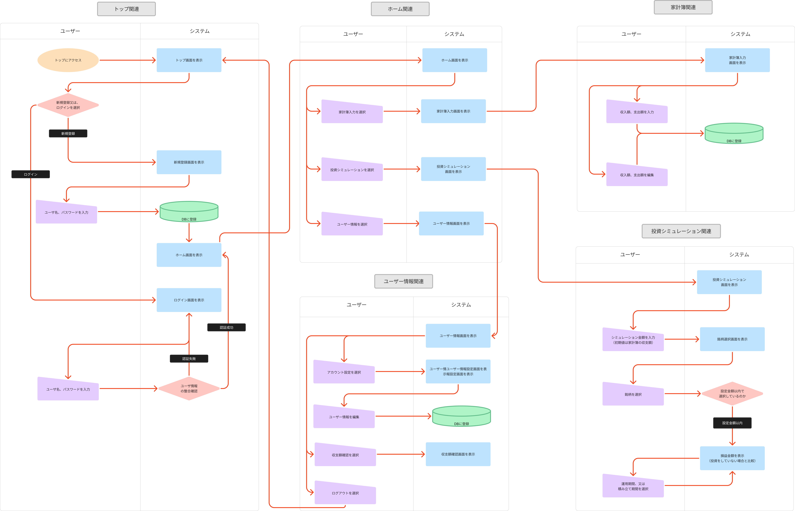
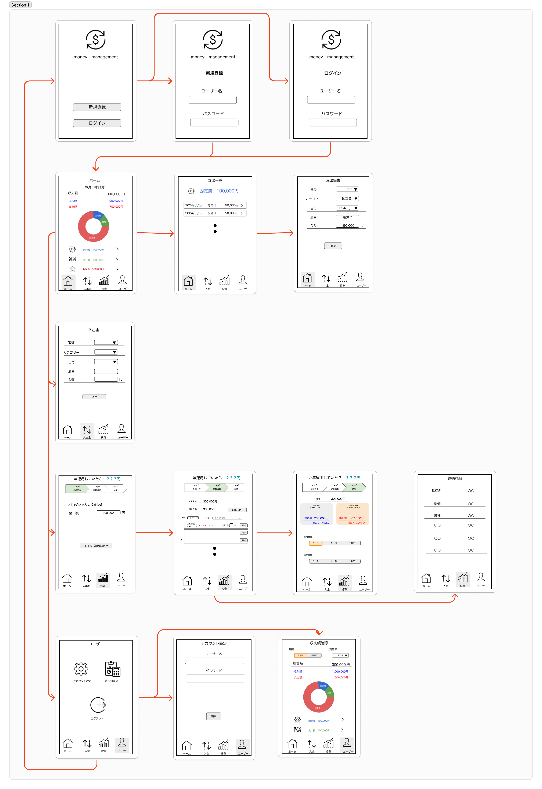

## ■　一言サービスコンセプト

## ■　サービスのURL
https://moneymanagement.jp/

## ■　誰のどんな課題を解決するのか
### 対象   
- 投資未経験者（特に両親）  
### 課題 
- 資産が減るリスクへの不安：「失敗して今の資産が減るのでは」というイメージの悪さ。  
- 知識不足による迷い：「どの投資商品を選べばよいのかわからない」という選択の難しさ。  
- 余裕資金の不足感：「投資に回せるお金がない」と感じ、行動に移せない。  

これらの課題を解決し、投資未経験者が一歩を踏み出すきっかけを提供、又はサポートすることを目指しています。

## ■　なぜそれを解決したいのか
### 投資が生む好循環
金融庁の調査によると、日本の家計金融資産約2000兆円のうち、半分以上が低リターンの現預金で保有されているようです。そのため、外国と比べて資産の増加スピードが低く、経済成長への貢献も限定的です。  
「貯蓄から投資」への転換により、家に眠る資金を企業の成長や社会課題解決に役立てるだけでなく、経済全体に好循環を生むことを期待しています。

### 預貯金運用のリスク
例えば、預金の金利が１％で、インフレ率が２％と仮定すると、１年後には、その口座のお金で今日買うよりも少ない物しか買えなくなってしまいます。現在の銀行金利では、インフレ率に追いつけず、資産価値が実質的に目減りしてしまいます。  
預貯金は安全と思われがちですが、「投資をやらないリスクも大きい」という気づきを提供したいです。

### 自身の経験から
私自身も、投資を始める際には知識不足やリスクへの不安から行動に移せずに悩んでいました。「何を選べばいいのかわからない」「資産が減ったらどうしよう」といった気持ちが強く、投資に対して後ろ向きな状態でした。  
そこで、自身と同じように悩んでいる人をサポートしたいと思い、「こんなサービスがあったら、不安を解消し一歩踏み出せるのではないか」と考え、自身の経験を踏まえたアイデアを形にしようと思い立ったのがきっかけです。

## ■　どうやって解決するのか
### 家計簿機能
「投資を始めたいけれど、そもそも余裕資金があるのか分からない」と感じている方には、家計簿機能で課題を解決します。この機能は、通常の家計簿アプリ同様に、支出をカテゴリ別に整理し、「意外とここに無駄が多いかも」と気づくきっかけを提供します。また、この家計簿により明らかになった１ヶ月あたりの収支額で、投資シミュレーションを活用することができるため、より自分の支出状況に応じたシミュレーションが可能です。単なる記録ではなく、投資を始めるための基盤を作るサポートツールとして活用できます。

### 実際の投資シミュレーション  
「投資を始めるのは不安」「どれくらいのリターンが期待できるの？」という課題の解決には、実際にシミュレーションをすることが一番効率が良いです。投資には、「分散」、「長期」、「積立」が必須とされているため、実際の銘柄を活用し、それらをシミュレーションすることが大切です。

しかし、既往サービスはそれらを解決できる機能が限定的です。

- 実際の銘柄を活用したシミュレーションは、短期運用をメインとした機能ばかりで、長期・積立形式を想定したものとなっていない
- 長期・積立形式のシミュレーションは自分で年利を設定しなければならず、実際の銘柄を活用したものとなっていない
- 物価上昇率を考慮していないため、現実的なシミュレーションとなっていない

この機能では、実際の株価データを使って、運用期間や積立金額を設定しながら、投資結果をシミュレーションできます。
例えば、「投資をした場合」と「しなかった場合」の資産を物価上昇率を考慮して比較。「やっぱり投資を始めた方がいいかも」と直感的に理解できます。これにより、リスクとリターンを具体的に把握し、不安を軽減しながら投資をスタートできるようになります。

## ■　機能要件
### トップ画面
- 新規登録とログイン画面が選択できる
- ユーザー名とパスワードを登録することができる
- 登録したユーザー名とパスワードでログイン認証ができる

### ホーム画面
- 収入額と支出額が表示される
- 支出額はカテゴリー毎に金額が表示される
- 支出額はカテゴリー毎にグラフが表示される
- 支出額はカテゴリー毎に一覧画面をもっている
- 登録した支出額と収入額は編集することができる

### 入出金画面
- 収入額と支出額を登録することができる

### 投資シミュレーション画面
- １ヶ月あたりのシミュレーション金額を設定できる
- 設定した金額内でシミュレーションしたい銘柄を（口数で）選択できる
- 設定した金額以上の銘柄は選択できない
- 設定金額、購入金額が表示される
- 購入金額は銘柄を選択する度に更新される
- 銘柄情報（銘柄名、終値、前日からの上昇率、カテゴリー）が一覧で表示される
- 表示される順番は純資産額が大きい順
- 銘柄をクリックすると財務情報が表示される
- カテゴリー別で銘柄を表示することができる
- 銘柄名で検索することができる
- 選択した銘柄はソートすることができる
- 銘柄選択後、運用期間、積立期間に応じて損益額が表示される
- 物価上昇率を考慮した投資の有無による損益額を比較することができる

### ユーザー画面
- ユーザー情報を編集することができる
- 過去の支出額と収入額を確認することができる
- 口座開設の動画紹介、インフルエンサーの紹介ページがある

## ■　非機能要件
- コア機能の充実/付属的な機能の作成
- スマホ及びPC両方のデザイン対応
- 投資未経験者でも直感的に操作できるUI/UX設計
- テストコードが書かれている

## ■　業務フロー

## ■　画面遷移図,ワイヤーフレーム

## ■　テーブル定義書
### ER図

### テーブル
Users:ユーザー
| 項目名        | 説明    | データ型        | 初期値 | 必須   | インデックス | キー      |
|------------|-------|-------------|-----|------|--------|---------|
| id         | ID    | BIGINT      |     | TRUE |        | PRIMARY |
| name       | 名前    | VARCHAR(50) |     | TRUE |        |         |
| password   | パスワード | VARCHAR(50) |     | TRUE |        |         |
| created_at | 作成日時  | TIMESTAMP   |     | TRUE |        |         |
| updated_at | 更新日時  | TIMESTAMP   |     | TRUE |

ExpenseLogs:家計簿
| 項目名         | 説明      | データ型        | 初期値 | 必須   | インデックス | キー      |
|-------------|---------|-------------|-----|------|--------|---------|
| id          | ID      | BIGINT      |     | TRUE |        | PRIMARY |
| user_id     | ユーザーID  | BIGINT      |     | TRUE | TRUE   | FOREIGN |
| category_id | カテゴリーID | BIGINT      |     | TRUE |        | FOREIGN |
| transaction_type        | 取引    | INT         |     | TRUE |        |  |
| date        | 日付     | DATE        |     | TRUE |        |         |
| item        | 項目      | VARCHAR(50) |     | TRUE |        |         |
| amout       | 金額      | BIGINT      |     | TRUE |        |         |
| created_at  | 作成日時    | TIMESTAMP   |     | TRUE |        |         |
| updated_at  | 更新日時    | TIMESTAMP   |     | TRUE |

Categories:カテゴリー
| 項目名  | 説明 | データ型        | 初期値 | 必須   | インデックス | キー      |
|------|----|-------------|-----|------|--------|---------|
| id   | ID | INT         |     | TRUE |        | PRIMARY |
| name | 名前 | VARCHAR(50) |     | TRUE |

Companies:銘柄
| 項目名       | 説明    | データ型         | 初期値 | 必須   | インデックス | キー      |
|-----------|-------|--------------|-----|------|--------|---------|
| code      | 銘柄コード | BIGINT       |     | TRUE | TRUE   | PRIMARY |
| sector_id | 業種ID  | INT  |     | TRUE |        | FOREIGN |
| name      | 名前    | VARCHAR(100) |     | TRUE | TRUE   |         |
| equity    | 純資産   | INT  |     | TRUE |

StockPrices:株価
| 項目名          | 説明    | データ型   | 初期値 | 必須   | インデックス | キー      |
|--------------|-------|--------|-----|------|--------|---------|
| id           | ID    | BIGINT |     | TRUE |        | PRIMARY |
| company_code | 銘柄コード | BIGINT |     | TRUE | TRUE   | FOREIGN |
| date         | 日付    | DATE   |     | TRUE |        |         |
| close_price  | 終値    | INT    |     | TRUE |

Sectors:業種
| 項目名  | 説明 | データ型        | 初期値 | 必須   | インデックス | キー      |
|------|----|-------------|-----|------|--------|---------|
| id   | ID | INT         |     | TRUE |        | PRIMARY |
| name | 名前 | VARCHAR(25) |     | TRUE |

## ■　システム構成図

